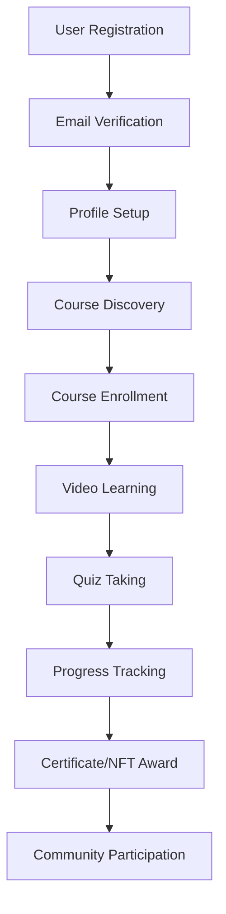

# 🎓 Wisentia - Modern Learning Management Platform


## 📖 Table of Contents

1. [Project Overview](#-project-overview)
2. [Features](#-features)
3. [Architecture](#-architecture)
4. [Technology Stack](#-technology-stack)
5. [Project Structure](#-project-structure)
6. [Installation & Setup](#-installation--setup)
7. [Project Workflow](#-project-workflow)
8. [API Documentation](#-api-documentation)
9. [Database Schema](#-database-schema)
10. [Contributing](#-contributing)
11. [License](#-license)

## 🌟 Project Overview

Wisentia is a comprehensive learning management platform that combines traditional e-learning with modern Web3 technologies. It provides a complete ecosystem for course creation, learning management, assessment, and blockchain-based rewards through NFTs.

### Key Objectives
- Provide an intuitive learning experience with video-based courses
- Implement gamification through quests and rewards
- Integrate blockchain technology for achievement verification
- Support community-driven learning and content creation
- Offer advanced analytics and progress tracking

## ✨ Features

### 🎥 Course Management
- **Video-based Learning**: YouTube integration for seamless video content delivery
- **Progress Tracking**: Real-time tracking of video watch progress and completion
- **Course Categories**: Organized content with category-based filtering
- **Enrollment System**: Automated course enrollment and access management

### 📝 Assessment System
- **Interactive Quizzes**: Comprehensive quiz system with multiple question types
- **AI-Generated Content**: Automated quiz and quest generation using Anthropic AI
- **Passing Scores**: Configurable passing criteria for assessments
- **Progress Analytics**: Detailed analytics on user performance

### 🎮 Gamification & Rewards
- **Quest System**: Interactive quests with challenges and rewards
- **NFT Rewards**: Blockchain-based achievement certificates
- **Point System**: Earning points for course completion and achievements
- **Community Features**: Social learning with forums and discussions

### 🔐 User Management
- **Authentication**: JWT-based secure authentication system
- **Role-based Access**: Admin, instructor, and student role management
- **Profile Management**: Comprehensive user profiles with wallet integration
- **Email Verification**: Secure account verification system

### 🌐 Web3 Integration
- **Wallet Integration**: MetaMask and Web3 wallet support
- **NFT Minting**: Custom NFT creation for course completion certificates
- **Blockchain Verification**: Achievement verification on blockchain
- **Token Economics**: Future-ready for token-based rewards

### 👥 Community Features
- **Discussion Forums**: Course-specific and general community discussions
- **User-generated Content**: Community-driven course creation
- **Social Learning**: Peer-to-peer learning experiences
- **Mentorship Programs**: Connect learners with experienced mentors

### 📊 Analytics & Admin Panel
- **Comprehensive Dashboard**: Real-time analytics and insights
- **User Analytics**: Detailed user behavior and progress tracking
- **Content Management**: Easy course and content administration
- **System Health Monitoring**: Platform performance and health metrics

## 🏗️ Architecture

### System Architecture
```
┌─────────────────┐    ┌─────────────────┐    ┌─────────────────┐
│   Frontend      │    │   Backend       │    │   Database      │
│   (Next.js)     │◄──►│   (Django)      │◄──►│  (SQL Server)   │
│                 │    │                 │    │                 │
│ - React         │    │ - REST API      │    │ - Course Data   │
│ - Material-UI   │    │ - Authentication│    │ - User Data     │
│ - Web3.js       │    │ - AI Integration│    │ - Progress      │
└─────────────────┘    └─────────────────┘    └─────────────────┘
         │                       │                       │
         └───────────────────────┼───────────────────────┘
                                 │
                    ┌─────────────────┐
                    │  External APIs  │
                    │                 │
                    │ - Anthropic AI  │
                    │ - YouTube API   │
                    │ - IPFS          │
                    │ - Blockchain    │
                    └─────────────────┘
```

### Application Flow
1. **User Registration/Login**: Secure authentication with JWT tokens
2. **Course Discovery**: Browse and filter available courses by category
3. **Enrollment**: Enroll in courses and track progress
4. **Learning**: Watch videos, take quizzes, complete assignments
5. **Assessment**: Complete quizzes and earn points
6. **Rewards**: Earn NFTs and certificates for achievements
7. **Community**: Participate in discussions and forums

## 🛠️ Technology Stack

### Frontend
- **Framework**: Next.js 14.1.0
- **UI Library**: Material-UI (MUI) v5
- **State Management**: React Context API
- **Styling**: Emotion CSS-in-JS
- **Charts**: Chart.js & Recharts
- **Rich Text Editor**: TipTap
- **Web3**: MetaMask Integration
- **Animations**: Framer Motion

### Backend
- **Framework**: Django 4.2 with Django REST Framework
- **Authentication**: JWT with SimpleJWT
- **Database**: Microsoft SQL Server
- **ORM**: Django ORM with mssql-django
- **API Documentation**: drf-yasg (Swagger)
- **Caching**: Redis (django-redis)
- **File Storage**: Local storage with media handling

### AI & External Services
- **AI Provider**: Anthropic Claude API
- **Video Platform**: YouTube API
- **Blockchain**: Web3.py for Ethereum integration
- **File Storage**: IPFS for decentralized storage
- **Email**: SMTP for notifications

### Development Tools
- **Version Control**: Git
- **Code Quality**: ESLint for frontend
- **API Testing**: Swagger UI
- **Database Tools**: SQL Server Management Studio

## 📁 Project Structure

```
WISENTIA_Q/
├── wisentia/
│   ├── wisentia_backend/          # Django Backend
│   │   ├── admin_panel/           # Admin dashboard
│   │   ├── ai/                    # AI integration (Anthropic)
│   │   ├── auth/                  # Authentication views
│   │   ├── community/             # Community features
│   │   ├── courses/               # Course management
│   │   ├── files/                 # File handling
│   │   ├── nfts/                  # NFT management
│   │   ├── notifications/         # Notification system
│   │   ├── quests/               # Quest system
│   │   ├── quizzes/              # Quiz system
│   │   ├── search/               # Search functionality
│   │   ├── subscriptions/        # Subscription management
│   │   ├── users/                # User management
│   │   ├── wallet/               # Web3 wallet integration
│   │   └── wisentia_backend/     # Main Django settings
│   │       ├── settings.py       # Configuration
│   │       ├── urls.py           # URL routing
│   │       └── middleware.py     # Custom middleware
│   │
│   ├── wisentia_frontend/         # Next.js Frontend
│   │   ├── src/
│   │   │   ├── app/              # Next.js App Router
│   │   │   │   ├── admin/        # Admin interface
│   │   │   │   ├── api/          # API routes
│   │   │   │   ├── courses/      # Course pages
│   │   │   │   ├── quizzes/      # Quiz interface
│   │   │   │   ├── nfts/         # NFT marketplace
│   │   │   │   ├── community/    # Community pages
│   │   │   │   └── auth/         # Authentication pages
│   │   │   ├── components/       # Reusable components
│   │   │   │   ├── admin/        # Admin components
│   │   │   │   ├── course/       # Course components
│   │   │   │   ├── chat/         # Chat components
│   │   │   │   └── shared/       # Shared components
│   │   │   ├── contexts/         # React contexts
│   │   │   ├── services/         # API services
│   │   │   └── utils/            # Utility functions
│   │   ├── public/               # Static assets
│   │   └── package.json          # Dependencies
│   │
│   ├── start_backend.bat          # Backend startup script
│   ├── start_frontend.bat         # Frontend startup script
│   └── powershell_commands.txt    # Setup commands
```

## 🚀 Installation & Setup

### Prerequisites
- **Node.js** 18+ and npm
- **Python** 3.9+
- **SQL Server** (Express edition or higher)
- **Git**
- **Redis** (optional, for caching)

### Backend Setup

1. **Clone the Repository**
   ```bash
   git clone <repository-url>
   cd WISENTIA_Q/wisentia/wisentia_backend
   ```

2. **Create Virtual Environment**
   ```bash
   python -m venv venv
   venv\Scripts\activate  # Windows
   source venv/bin/activate  # Linux/Mac
   ```

3. **Install Dependencies**
   ```bash
   pip install -r requirements.txt
   ```

4. **Database Configuration**
   - Install SQL Server
   - Create database named `WisentiaDB`
   - Update `settings.py` with your SQL Server configuration:
   ```python
   DATABASES = {
       'default': {
           'ENGINE': 'mssql',
           'NAME': 'WisentiaDB',
           'HOST': 'YOUR_SERVER_NAME\\SQLEXPRESS',
           'OPTIONS': {
               'driver': 'ODBC Driver 17 for SQL Server',
               'trusted_connection': 'yes',
           },
       }
   }
   ```

5. **Run Migrations**
   ```bash
   python manage.py makemigrations
   python manage.py migrate
   ```

6. **Create Superuser**
   ```bash
   python manage.py createsuperuser
   ```

7. **Start Backend Server**
   ```bash
   python manage.py runserver
   # or use the batch file
   start_backend.bat
   ```

### Frontend Setup

1. **Navigate to Frontend Directory**
   ```bash
   cd ../wisentia_frontend
   ```

2. **Install Dependencies**
   ```bash
   npm install
   ```

3. **Environment Configuration**
   Create `.env.local` file:
   ```bash
   NEXT_PUBLIC_API_URL=http://localhost:8000/api
   NEXT_PUBLIC_WEB3_ENABLED=true
   ```

4. **Start Frontend Server**
   ```bash
   npm run dev
   # or use the batch file
   start_frontend.bat
   ```

### Access URLs
- **Frontend**: http://localhost:3000
- **Backend API**: http://localhost:8000/api
- **Admin Panel**: http://localhost:3000/admin
- **API Documentation**: http://localhost:8000/swagger/

## 🔄 Project Workflow

### Development Workflow



### User Journey

1. **Registration & Onboarding**
   - User registers with email and password
   - Email verification process
   - Profile completion with optional wallet connection

2. **Course Discovery**
   - Browse courses by category
   - Filter by difficulty, popularity, or rating
   - Preview course content and syllabus

3. **Learning Process**
   - Enroll in selected courses
   - Watch video content with progress tracking
   - Take interactive quizzes
   - Complete assignments and projects

4. **Assessment & Rewards**
   - Complete course assessments
   - Earn points and certificates
   - Receive NFT rewards for achievements
   - Build learning portfolio

5. **Community Engagement**
   - Participate in course discussions
   - Ask questions and help others
   - Share achievements and progress
   - Connect with mentors and peers

### Admin Workflow

1. **Content Management**
   - Create and manage courses
   - Upload video content and materials
   - Design quizzes and assessments
   - Set course prerequisites and objectives

2. **AI-Assisted Content Creation**
   - Generate quiz questions using AI
   - Create quest challenges automatically
   - Optimize content based on learning analytics

3. **User Management**
   - Monitor user progress and engagement
   - Manage enrollments and access
   - Handle support requests and issues

4. **Analytics & Optimization**
   - Track platform usage and performance
   - Analyze learning outcomes
   - Optimize content based on data insights

## 📚 API Documentation

### Authentication Endpoints
- `POST /api/auth/login/` - User login
- `POST /api/auth/register/` - User registration
- `POST /api/auth/logout/` - User logout
- `POST /api/auth/refresh-token/` - Refresh JWT token
- `GET /api/auth/profile/` - Get user profile

### Course Management
- `GET /api/courses/` - List all courses
- `GET /api/courses/{id}/` - Get course details
- `POST /api/courses/{id}/enroll/` - Enroll in course
- `GET /api/courses/{id}/videos/` - Get course videos
- `POST /api/courses/videos/{id}/track/` - Track video progress

### Quiz System
- `GET /api/quizzes/video/{video_id}/` - Get quizzes for video
- `POST /api/quizzes/{quiz_id}/submit/` - Submit quiz answers
- `GET /api/quizzes/{quiz_id}/results/` - Get quiz results

### NFT & Rewards
- `GET /api/nfts/` - List user NFTs
- `POST /api/nfts/mint/` - Mint achievement NFT
- `GET /api/nfts/{id}/` - Get NFT details

### Admin Endpoints
- `GET /api/admin/analytics/` - Platform analytics
- `POST /api/admin/courses/create/` - Create new course
- `GET /api/admin/users/` - Manage users
- `POST /api/admin/generate-quiz/` - AI-generated quiz

For complete API documentation, visit: http://localhost:8000/swagger/

## 🗄️ Database Schema

### Core Tables

**Users Table**
- UserID (Primary Key)
- Username, Email, Password
- UserRole (admin, instructor, student)
- WalletAddress, ProfilePicture
- CreationDate, LastLogin

**Courses Table**
- CourseID (Primary Key)
- Title, Description, Category
- Difficulty, ThumbnailURL
- CreationDate, IsActive

**CourseVideos Table**
- VideoID (Primary Key)
- CourseID (Foreign Key)
- Title, Description, YouTubeVideoID
- Duration, OrderInCourse

**UserVideoViews Table**
- ViewID (Primary Key)
- UserID, VideoID (Foreign Keys)
- WatchedPercentage, IsCompleted
- LastPosition, EarnedPoints

**Quizzes Table**
- QuizID (Primary Key)
- VideoID (Foreign Key)
- Title, Description, PassingScore
- QuestionCount, IsActive

**UserCourseEnrollments Table**
- EnrollmentID (Primary Key)
- UserID, CourseID (Foreign Keys)
- EnrollmentDate, IsActive

**UserCourseProgress Table**
- ProgressID (Primary Key)
- UserID, CourseID (Foreign Keys)
- CompletionPercentage, IsCompleted
- LastAccessDate, CompletionDate

### Additional Tables
- **QuizQuestions**: Quiz question management
- **UserQuizAttempts**: Quiz attempt tracking
- **NFTs**: NFT metadata and ownership
- **CommunityPosts**: Forum and discussion posts
- **Quests**: Gamification quests and challenges
- **ActivityLogs**: User activity tracking

*Empowering learning through technology and innovation.* 
